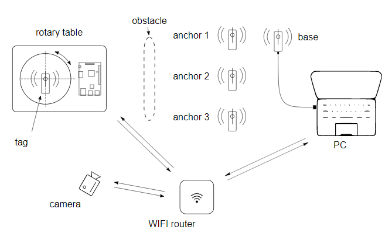

# UWB weak-NLOS strucutred dataset
Structured dataset of UWB measurements in static weak NLOS scenarios containing over 1.2M samples.

## Acquisition
The setup consists of a tag, three anchors, a base anchor and a host PC connected to the base node via USB. The tag is centred on a electrically actuated rotary table to get different relative angles between sending and receiving antenna for each setup. Care is taken to align the rotation axis with the symmetry axis ofthe antenna. A Python script running on the host-PC sends commands via TCP-IP socket connection to a Raspberry-Pi single-board computer generating the actuation commands for the rotary table. The connection between PC and Raspberry-Pi is established using a mobile Wi-Fi router. Rotary table and Raspberry-Pi are mounted on a wooden board to reduce bothersome cable management to a single power-line. Additionally, a smartphone camera is used to film each data capturing setup for documentation purposes. The camera is triggered over WIFI using adb-commands. The first frame of each clip can be found in the `cam` subfolders.



## Datasets
In total, 1.2 million data points were collected and structured in 36 data sets. The data sets differ in weak NLOS environment  (15 in corridor, 12 in lab, 5 outdoors, 4 in anechoic chamber), in ground truth distance  (1, 3, 5 and 8m), and in obstacle on the LOS path (none, non-conductive wooden wall, conductive flipchart, human). Per data set, 20 relative angular orientations differing by 18° were adjusted and for each 200 DS-TWR cycles between 3 node pairs were performed. For each DS-TWR packet, 10 features and the CIR were measured.

### Environments
* Lab: A congested room with chairs, tables and things mounted to the walls, which is often the case in office-, lab- and residential environments.
* Corridor: A narrow corridor with flat uncongested walls present in many public buildings.
* Outdoor: Free space propagation except for reflections caused by nearby buildings and the ground.
* Anechoic chamber: Multipath free environment for reference.

### Obstacles
* Non conducting objects: Wooden blocks were used to simulate obstruction caused by non conductive objects like wooden furniture.
* Conductive objects: A metal whiteboard should simulate blockage caused bymetal objects.
* Humans: When UWB is used in wearable devices the line of sight is usually obstructed in one direction.

### Segmentation
Our measurements are segmented into 36 sets, which we decided to split into 24 training sets and 12 test sets. Per data set, 20 relative angular orientations differing by 18° were adjusted and for each 200 DS-TWR cycles between 3 node pairs were performed.

| Environment \| #Train/#Test | anechoic | corridor | lab | outdoor | sum  |
|----------------------------|----------|----------|-----|---------|------|
| LOS                        | 2/2      | 2/2      | 2/2 | 2/1     | 8/7  |
| human                      | 0/0      | 3/1      | 0/1 | 2/0     | 5/2  |
| wood                       | 0/0      | 3/1      | 2/0 | 0/0     | 5/1  |
| flipchart                  | 0/0      | 2/1      | 2/0 | 0/0     | 4/1  |
| monitor                    | 0/0      | 0/0      | 2/1 | 0/0     | 2/1  |
| sum                        | 2/2      | 10/5     | 8/4 | 4/1     | 24/12 |


## How to use our datasets
All data sets are stored as Pandas dataframes. We used pickle to serialize them.
````
python==3.9.6
pandas==1.3.2
````

## Check also our paper
Link to be added.

## Authors
Philipp Peterseil<br>
David Märzinger<br>
Bernhard Etzlinger<br>


Institute for Communications Engineering and RF-Systems<br>
https://www.jku.at/institut-fuer-nachrichtentechnik-und-hochfrequenzsysteme/
